# Coddict

<!-- ## Full-Stack Web Developer -->
[][coddict]

[][linkedin]
[][twitter]

Everything Web Development, front-end or back-end. All using latest .NET, Node.js, JavaScript, TypeScript, Angular, WordPress and More...

[][youtube]
[][youtube]
[][coddict]
[][coddict]
[][coddict]
[][coddict]

 
 

### Connect with me:

[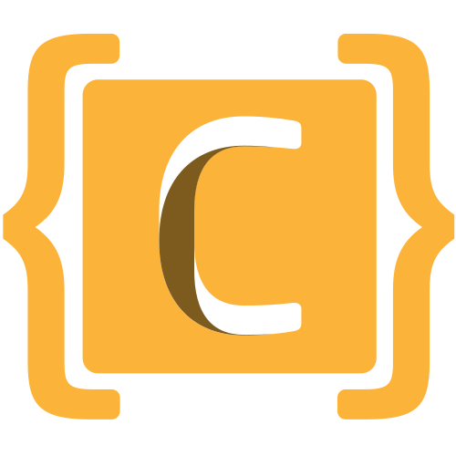][coddict]
[][youtube]
[][twitter]
[][facebook]
[][linkedin]
[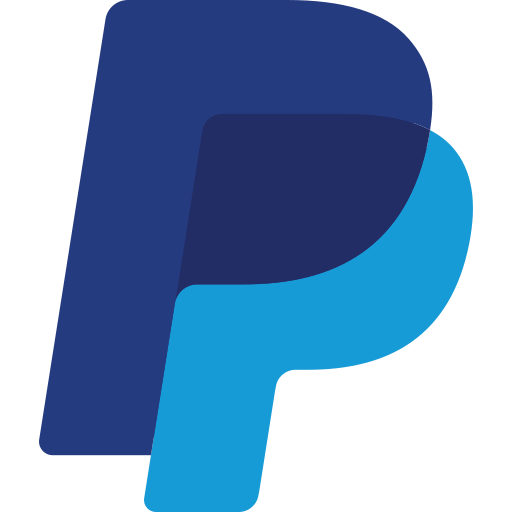][paypal]
[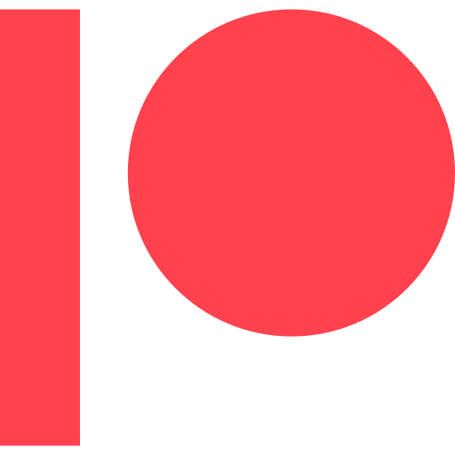][patreon]

 
 

## Technologies
### Languages:

[][youtube]
[][youtube]
[][youtube]
[][youtube]
[][youtube]

 

### Frontend:
[][youtube]
[][youtube]
[][youtube]
[][youtube]

 

### Backend:
[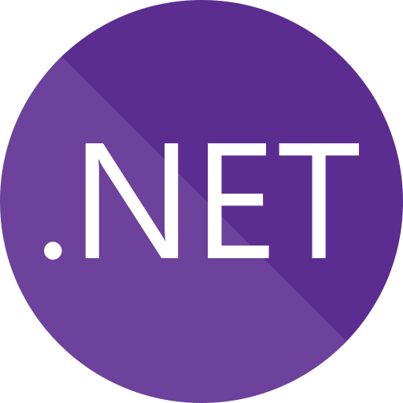][youtube]
[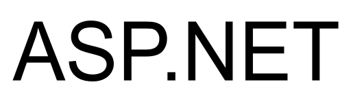][youtube]
[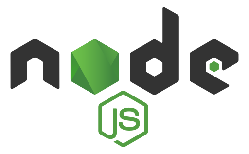][youtube]
[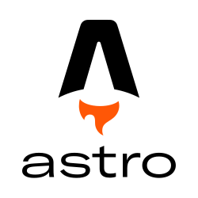][youtube]
[][youtube]

 
 

### Database:
[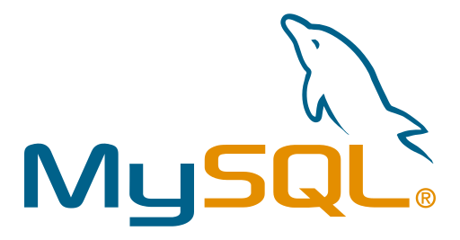][youtube]
[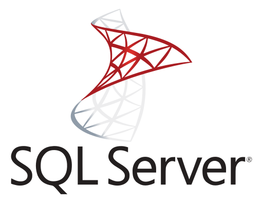][youtube]
[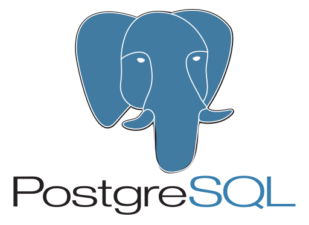][youtube]
[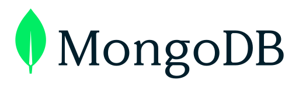][youtube]

 
 

### Tools:
[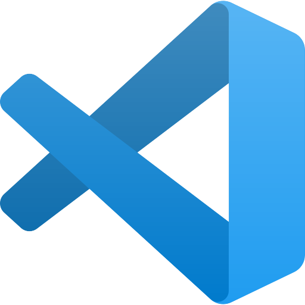][youtube]
[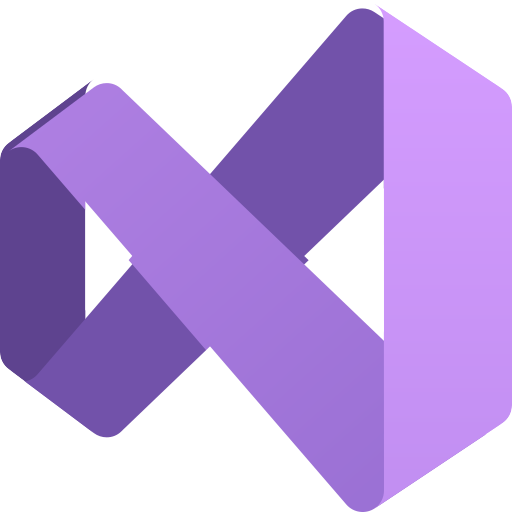][youtube]
[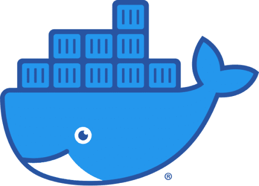][youtube]
[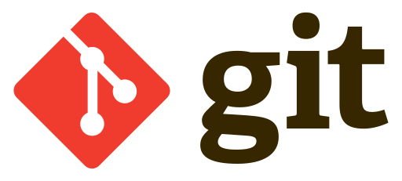][youtube]
[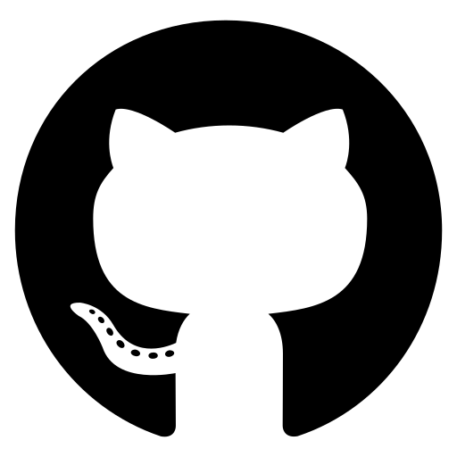][youtube]
[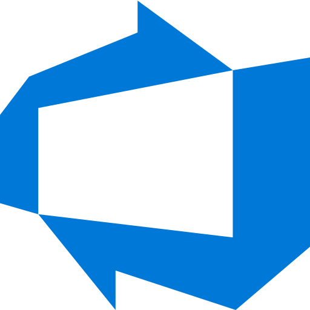][youtube]
[][youtube]

 
 
 

## VS Code - Extensions
[**.NET Core Pack:**](https://marketplace.visualstudio.com/items?itemName=coddictco.net-vscode-pack)

 

[**Angular Pack:**](https://marketplace.visualstudio.com/items?itemName=coddictco.angular-vscode-pack)

 

[**Productivity Plus:**](https://marketplace.visualstudio.com/items?itemName=coddictco.productivity-plus)

[coddict]: https://coddict.co
[youtube]: https://www.youtube.com/@coddict?sub_confirmation=1
[linkedin]: https://www.linkedin.com/company/coddictco/
[twitter]: https://twitter.com/intent/follow?screen_name=coddictco
[facebook]: https://www.facebook.com/coddictco
[paypal]: https://paypal.me/coddict
[patreon]: https://www.patreon.com/coddict

